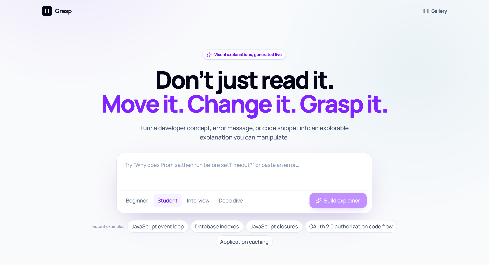
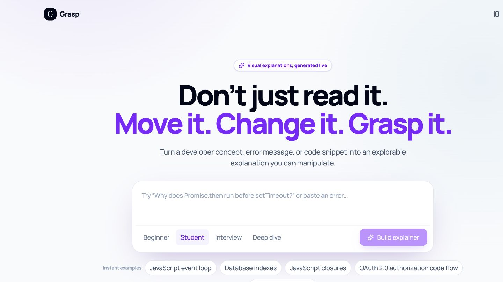
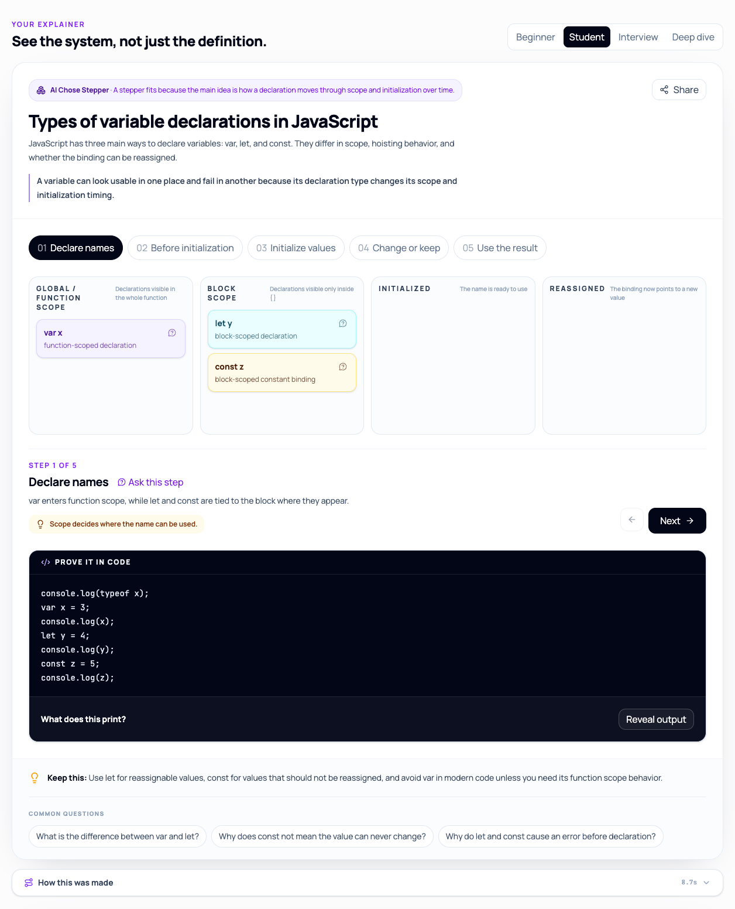
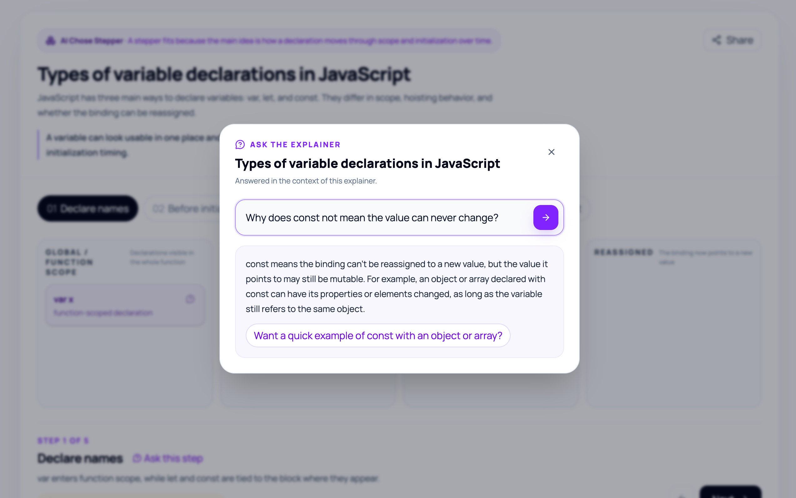
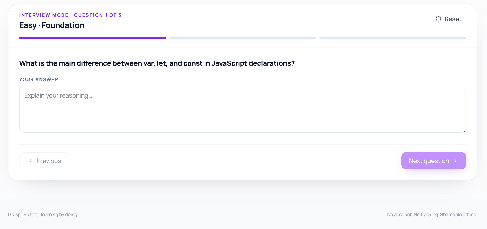
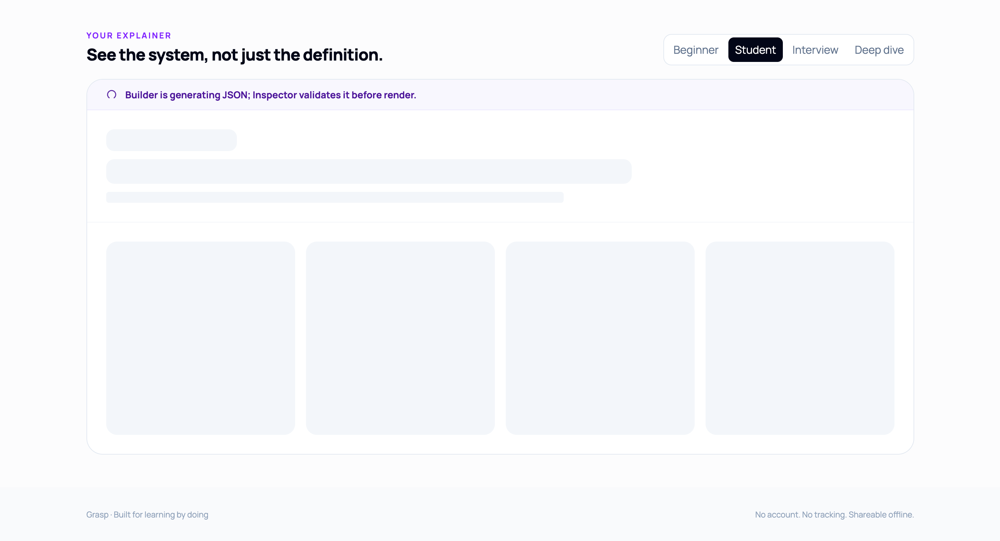
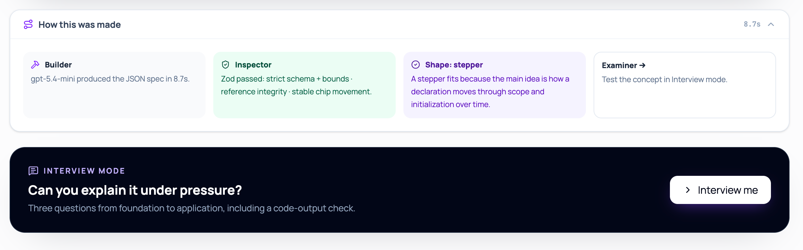

# Grasp

Turn any developer concept, error message, or code snippet into an interactive explainer you can poke, step through, and share.

**[Open Grasp](https://grasp-flame.vercel.app)** · **[Watch the 2:26 demo](https://drive.google.com/file/d/1bCx5vCYUxy2cPU_u7XlmHSReDH-WzfPS/view?usp=sharing)** · **[View the deck](https://docs.google.com/presentation/d/1kAELp3qi3BsDTb_PlvOF6yYZ4uJ3srCZHjkB5iZfyV4/edit?usp=sharing)** · **[Explore the gallery](https://grasp-flame.vercel.app/gallery)**

[](https://grasp-flame.vercel.app)

## Why

Explorable explanations make difficult concepts easier to understand than another wall of text. Building a correct interactive explanation normally takes an expert days. Grasp generates one in seconds, at four depth levels, from anything you type or paste.

## What you get

- An animated walkthrough where stable objects move between states, or a live chart playground whose controls expose a trade-off. The model chooses the interaction and explains why.
- An optional predict-then-reveal code proof with an exact, deterministic result.
- “Ask the explainer” on any step, chip, scenario, or suggested question.
- Interview mode with three concept-specific questions and answer grading.
- A shareable URL that renders offline, with no database and no account.
- Eight hand-verified examples that load instantly without an AI request.

## See it in action

<p align="center">
  <a href="https://drive.google.com/file/d/1bCx5vCYUxy2cPU_u7XlmHSReDH-WzfPS/view?usp=sharing">
    
  </a>
</p>

<p align="center"><strong><a href="https://drive.google.com/file/d/1bCx5vCYUxy2cPU_u7XlmHSReDH-WzfPS/view?usp=sharing">Watch the complete product demo →</a></strong></p>

### Explore the generated explanation

<p align="center">
  
</p>

### Ask, then practice

| Ask in context                                                                                   | Practice under pressure                                                                                  |
| ------------------------------------------------------------------------------------------------ | -------------------------------------------------------------------------------------------------------- |
|  |  |
| Ask about the exact step or object you are exploring.                                            | Work through three questions from foundation to application.                                             |

### See the system working

| Visible generation                                                                                   | Real pipeline trace and next step                                                                                     |
| ---------------------------------------------------------------------------------------------------- | --------------------------------------------------------------------------------------------------------------------- |
|  |              |
| Loading keeps its shape while Builder generates and Inspector validates.                             | The trace reports the actual model, validation result, chosen interaction, and timing before handing off to practice. |

## How it works

The model never writes UI code. It returns data that must cross a strict validation boundary before hardened React primitives can render it.

```text
user input
  → Builder: one server-only structured model call
  → Inspector: deterministic Zod validation + cross-field invariants
      ↳ valid: render
      ↳ invalid: Repairer receives the validation issues once
          → Inspector runs again
              ↳ movement is the only remaining issue: render safely without claiming movement passed
              ↳ any safety or structural issue remains: return a friendly retry
  → Stepper or Playground React primitive
  → optional learner-triggered calls: Ask or Interview
```

- [`lib/schema.ts`](./lib/schema.ts) is the trust boundary for every model response. It checks bounds, IDs, references, scenario coverage, stable chip placement, and other relational rules that a JSON shape alone cannot express.
- [`lib/openai.ts`](./lib/openai.ts) permits exactly one validation-driven repair. Quality bars such as chip movement may then degrade gracefully; safety and structural bars still fail hard.
- Stepper chips reuse stable IDs with Framer Motion `layoutId`, so the same object glides between columns across steps.
- Playground charts use explicit, precomputed scenarios. Grasp never executes model-authored formulas, UI code, or example code.
- Shared explainers encode their validated spec in the URL. They need no database or OpenAI request to render.
- Public AI routes apply a bounded per-IP token bucket and a per-instance concurrency ceiling before parsing request bodies.

Live explainers include a collapsible **How this was made** trace. Every displayed stage represents real work: it reports the actual model, total generation time, deterministic validation checks, archetype rationale, and whether the repair path ran. Cached examples and shared links do not invent pipeline metadata.

## Tested like a product

[`scripts/quality-harness.mjs`](./scripts/quality-harness.mjs) runs 28 live-generation cases covering JavaScript internals, React and backend concepts, error pastes, code snippets, prompt injection, Hindi input, vague prompts, and a non-developer topic. It saves every response for review and automatically flags motionless steppers, unused chips, playgrounds with dead controls, and duplicate scenario explanations.

The latest full local run produced **27/28 schema-valid specs with a 7.5s p50**. It also flagged five motionless steppers and one playground whose control did not change its chart. Those are interaction-quality signals, not hidden successes: Grasp can safely render a motionless result after one repair, but incomplete scenario coverage, invalid references, unused chips, and other structural failures return a friendly retry instead of questionable data.

### Honest limitations

Grasp has two polished archetypes, not a universal visualization grammar. Some concepts—especially broad comparisons—can be correct but less interactive when the repaired result has no meaningful movement. Model latency and output quality vary, and one of the latest 28 live cases still returned the friendly retry state.

## What next

Grasp is deliberately a small tool right now: two archetypes, no accounts, no persistence. These are the four things we'd build next, in order, and why:

1. **A fact-check pass.** Zod guarantees a spec is well-formed, not that it is true. A second model call would review each live explainer and surface cautions — annotating, never editing, with the same hard rule as the rest of the pipeline: the critic can flag content, but only validated data reaches the screen. This is the most honest gap in the product today.
2. **A code-trace archetype.** Paste your own function and step through it line by line, with variables as moving chips. Most requests the current archetypes fit least well are exactly this shape, and it turns Grasp from "explains concepts" into "explains _your_ code".
3. **A personal library with spaced review.** Explainers currently live in URLs and nowhere else. A local-first library ("review these five before Tuesday's interview") would close the loop from understanding to retention — without adding accounts.
4. **Embeds.** Every explainer already renders offline from a self-contained URL, so embedding live explainers in courses, docs, and blog posts is a small step — and it's how a lesson built in five seconds reaches more than one learner.

## Built with Codex

Grasp was built solo in a few days with OpenAI Codex as the primary builder. Every request, implementation decision, uncertainty, and direction change is recorded per commit in [`BUILD_LOG.md`](./BUILD_LOG.md). Commits follow the Conventional Commits specification.

## Stack

- Next.js App Router, React, and TypeScript
- Tailwind CSS and shadcn-style UI primitives
- Zod
- Framer Motion
- Recharts
- OpenAI Node SDK and Responses API
- Vitest and React Testing Library
- ESLint, Prettier, and GitHub Actions

## Routes

| Route            | Responsibility                                                              |
| ---------------- | --------------------------------------------------------------------------- |
| `/`              | Concept input, level selector, examples, explainer, Ask, and Interview mode |
| `/gallery`       | Eight verified offline explainers                                           |
| `/e/[spec]`      | Validates and renders a URL-contained shared spec                           |
| `/api/generate`  | Generates, validates, repairs once, and returns an explainer spec           |
| `/api/ask`       | Answers one validated contextual follow-up about an explainer               |
| `/api/interview` | Generates three interview questions or grades three answers                 |

## Local development

Requirements: Node.js 22 and npm.

```bash
npm install
cp .env.example .env.local
npm run dev
```

Environment variables:

| Variable           | Required | Purpose                                                                                    |
| ------------------ | -------- | ------------------------------------------------------------------------------------------ |
| `OPENAI_API_KEY`   | For AI   | Server-only key used by generation, Ask, Interview questions, and grading                  |
| `OPENAI_MODEL`     | No       | Model override; defaults to `gpt-5.4-mini`                                                 |
| `DISABLE_AI_GUARD` | No       | Set to `1` only for local harness runs; the application ignores it when running production |

Without an API key, the gallery, cached examples, and URL-contained shared explainers still work.

To run the live quality harness without consuming the normal local rate-limit bucket:

```bash
# terminal 1 — the bypass is disabled automatically in production
DISABLE_AI_GUARD=1 npm run dev

# terminal 2
npm run quality:live
```

Use `ONLY=3,17` to rerun selected cases and `CONCURRENCY=1` through `4` to control local parallelism. The harness refuses non-local targets.

## Quality gates

```bash
npm run format:check
npm run lint
npm run typecheck
npm test
npm run build
```

The same gates run in [`.github/workflows/ci.yml`](./.github/workflows/ci.yml) on pull requests and pushes to `main`.

## Deployment

Deploy the repository as a standard Next.js project on Vercel. Set `OPENAI_API_KEY` as a server-side environment variable and optionally set `OPENAI_MODEL`. No database, authentication provider, or persistent volume is required.

Before making a deployment public:

1. Create a dedicated OpenAI project and restricted API key for Grasp.
2. Allow only the deployed model and set conservative request and token limits in the OpenAI project.
3. Configure budget alerts at multiple thresholds. Project budgets are alerts, not hard spending caps.
4. Verify that cached examples, the gallery, and shared URLs render without `OPENAI_API_KEY`.

The application allows a burst of six AI requests per client IP, refills one token every 20 seconds, and permits four concurrent AI operations per server instance. Rejections include `Retry-After` and a learner-facing message. Because Vercel instances do not share memory and may restart, this is best-effort abuse resistance rather than a durable global quota.

<details>
<summary>Implementation map</summary>

```text
app/
  api/ask/route.ts
  api/generate/route.ts
  api/interview/route.ts
  e/[spec]/page.tsx
  gallery/page.tsx
  page.tsx
components/
  ArchetypeBadge.tsx
  AskPopover.tsx
  CodeProof.tsx
  InterviewMe.tsx
  PipelineTrace.tsx
  Playground.tsx
  Stepper.tsx
lib/
  ai-request-guard.ts
  openai.ts
  pipeline.ts
  rate-limit.ts
  schema.ts
  share.ts
  showcase.ts
```

`flow` is intentionally excluded until both core archetypes are consistently polished.

</details>
